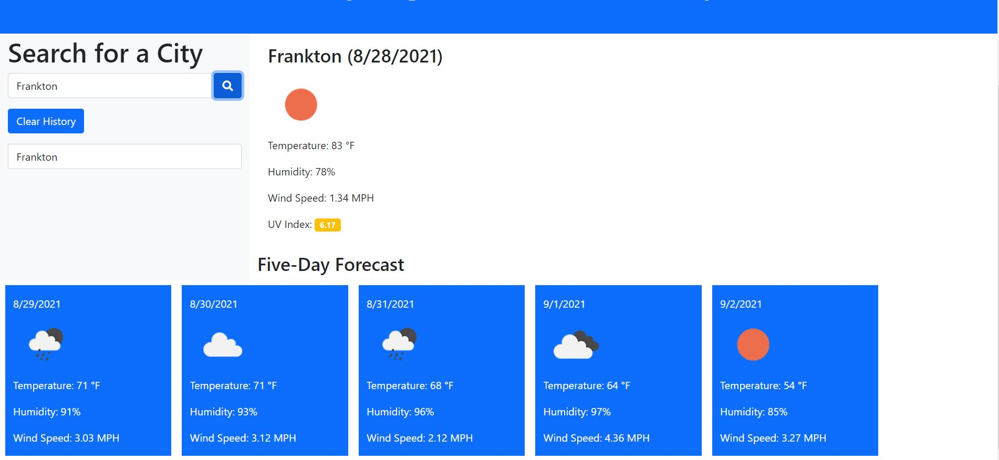

# weather-dashboard

## Purpose
This website provides the weather forecast based off the name of the city being searched. Once a city is entered, the current day's forecast is provided as well as the five day forecast. The user can for the weather for multiple cities, and previous cities will be able to be viewed if selected.

## Built with
    * HTML
    * CSS
    * JQuery
    * Bootstrap
    * Moment.JS
    * REST API
## Website
 https://kdchurch1994.github.io/weather-dashboard/

 ## Image

 ## Contribution
 Made By Kyle Church